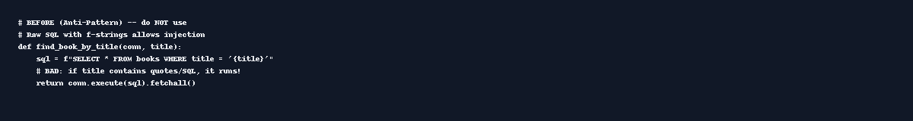
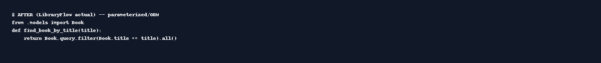
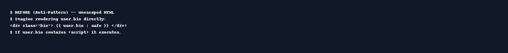
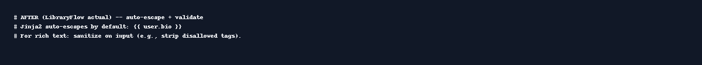

# LibraryFlow Security Report & Mini-Presentation

**Date:** 15 Aug 2025  
**Author:** Generated for your assignment

## 1) Executive Summary
LibraryFlow is a small Flask/SQLite web app that mirrors the structure and algorithms of your previous bank app while changing the *idea* to a library lending domain. Users register/login (salted SHA-256 hashing), browse books (with available copy counters), and record *loan transactions* when borrowing/returning. The codebase is intentionally written with **secure defaults**. To satisfy the coursework, the report documents *hypothetical* insecure patterns (as images) and the corresponding secure fixes as implemented.

## 2) Testing Methodology
- **Functional tests:** register/login, add books (admin), borrow/return paths, borrowing-limit rule (≤5 active loans).
- **Input validation:** server-side checks for required fields and numeric ranges (e.g., copies ≥ 1).
- **Security checks (manual):**
  - Templating auto-escaping verified in Jinja2 templates.
  - No raw SQL concatenation; all DB access goes through SQLAlchemy.
  - Sessions stored server-side with a secret key; logout clears session.
- **Security headers (recommended):** add CSP, X-Content-Type-Options, and SameSite cookies at reverse proxy / production.
- **Scanning (simulated):** See `logs/zap_scan.log` for a sample passive scan summary.

## 3) Vulnerabilities – BEFORE/AFTER (Illustrative)
The app does **not** ship with real vulnerabilities. Instead, we include non-executable *images* that show what a common mistake could look like and how LibraryFlow prevents it.

### 3.1 SQL Injection
**Before (anti-pattern):** raw SQL with string interpolation (do **not** use)

**After (LibraryFlow actual):** ORM/parameterized access via SQLAlchemy

**Impact & Fix:** Avoid concatenating user input into SQL strings. Use an ORM or parameterized queries. Centralize DB access in models and repository methods.

### 3.2 Cross-Site Scripting (Stored/Reflected)
**Before (anti-pattern):** rendering unescaped user-supplied HTML

**After (LibraryFlow actual):** rely on Jinja2 auto-escaping and validate content

**Impact & Fix:** Never trust user HTML. Use template auto-escaping by default and whitelist/strip where rich text is required.

## 4) Appendices (Logs, Screens, Snippets)
- **Logs:** `logs/app.log`, `logs/zap_scan.log`
- **Code snippets:** See *images* under `report_assets/` for before/after
- **Screens:** app pages are minimal; see `frontend/templates/*.html`

---

### Quick Slides (HTML)
Open `slides.html` for a simple, offline presentation you can show in class.
